# Conversion Quality Router

A local decision-support system for e-commerce session review. It estimates purchase probability, prioritizes strong signals, sends uncertain cases to a person, and logs clear negatives.

The project uses a public dataset and does not process live customer traffic.

[](LICENSE)
[](https://www.python.org/downloads/release/python-3110/)

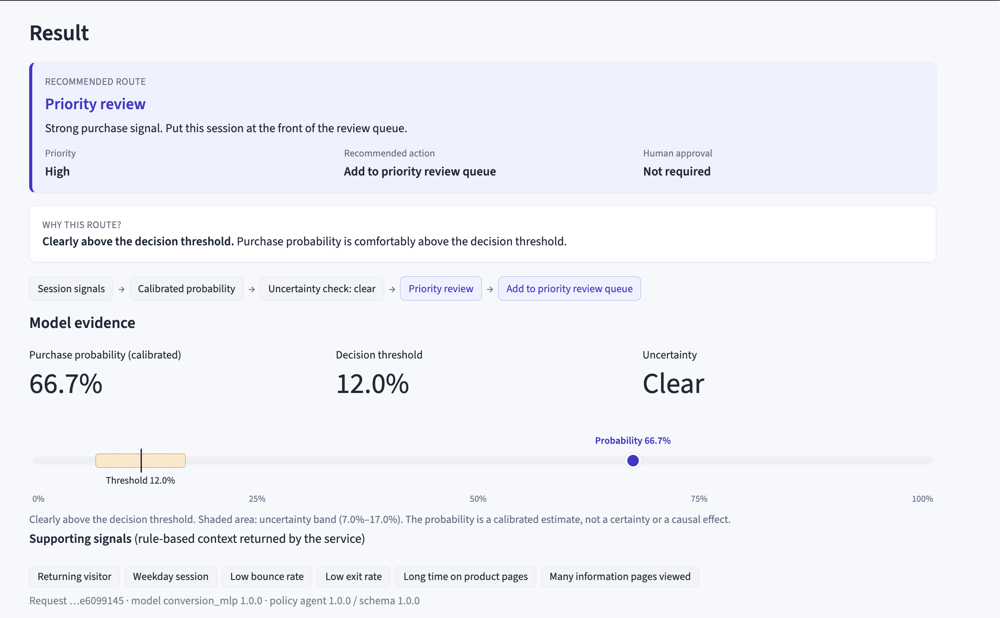

*The result view puts the model evidence and the recommended action on one screen.*

## Why it exists

A probability alone does not tell an analyst what to do. The same score may need immediate attention, human judgment, or no review at all. This project turns a calibrated probability into one of three routes.

- **Priority review:** A strong signal goes to the front of the queue.
- **Human review:** An uncertain result goes to a person.
- **Log automatically:** A clear negative is kept for audit without using reviewer time.

The model makes the prediction. A constrained agent chooses a route from a fixed policy. Schema and policy checks reject inconsistent output. Any model, agent, or network failure goes to human review. Reviewer feedback stays in a local append-only store and never retrains the model automatically.

## Local quickstart

```bash
# One-time setup
python3.11 -m venv venv
venv/bin/python -m pip install --upgrade pip
venv/bin/python -m pip install -e ".[dev,ui]"
venv/bin/python scripts/download_data.py
venv/bin/python scripts/make_split.py
venv/bin/python scripts/train_baseline.py
venv/bin/python scripts/select_baseline_threshold.py
venv/bin/python scripts/train_mlp.py
venv/bin/python scripts/calibrate_mlp.py
venv/bin/python scripts/finalize_mlp.py
venv/bin/python scripts/evaluate_test.py

# Start the local UI without external calls
scripts/start_ui.sh
```

Open **http://127.0.0.1:8501** and try the three presets.

1. **Strong purchase signal** returns priority review.
2. **Uncertain signal** returns human review.
3. **Weak signal** returns automatic logging.
4. Agree with a recommendation or override it with a reason.
5. Check the queue and feedback tabs.

Stop the demo with `scripts/stop_ui.sh`. See [docs/architecture.md](docs/architecture.md) for setup details and troubleshooting.

## Product walkthrough

### Evaluate a session

Basic mode uses readable presets. Advanced mode exposes the model's numeric and categorical inputs. Both modes send the same 16 features to the API.

Model-only evaluation returns the calibrated probability, threshold, uncertainty band, and supporting signals. Full routing also returns the recommended route, priority, and action.

The reviewer can agree or override after a full-routing result. The app saves that response in local SQLite with a structured reason and the relevant version identifiers.

### Review queue

The queue groups sessions by route and sorts them by priority. It lasts only for the current browser session. Clearing the queue does not affect the feedback database.

### Feedback and audit

The feedback tab shows every recorded decision, agreement and override rates, override direction, and common reasons. These records support later human review of the policy. They do not change the model, threshold, or routing rules.

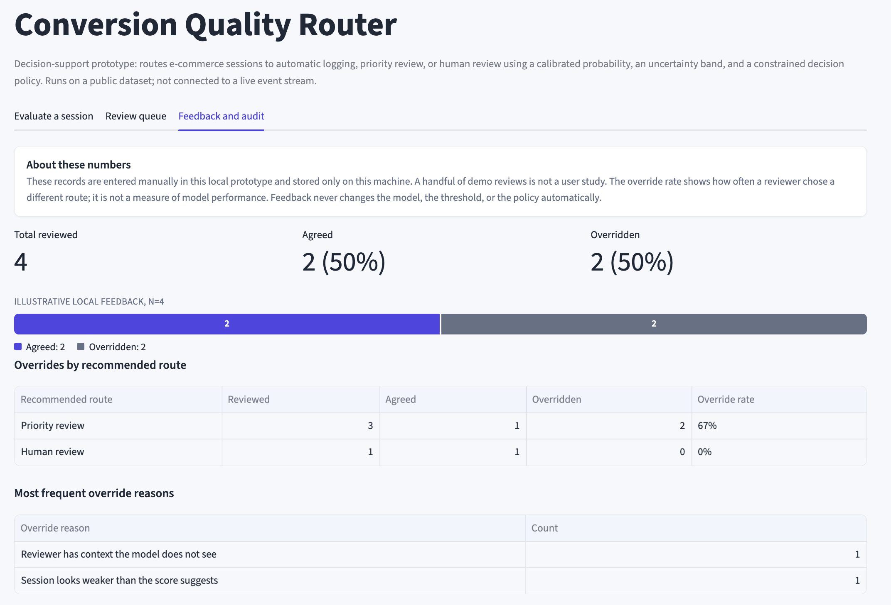

*Four local demo reviews illustrate the audit summary. They are not user-study results.*

## Operational impact

The frozen test split contains 1,845 sessions and 286 conversions. The routing policy distributes them as follows.

| Route | Sessions | Share | Conversions in route | Conversion coverage |
|---|---:|---:|---:|---:|
| Priority review | 885 | 48.0% | 223 (25.2% route rate) | 78.0% |
| Human review | 362 | 19.6% | 50 (13.8% route rate) | 17.5% |
| Log automatically | 598 | 32.4% | 13 (2.2% route rate) | 4.5% |

The combined review queue covers 67.6% of sessions and captures **95.5%** of observed conversions. A random queue of the same size would capture 67.6%. The automatic log contains 13 conversions, or 4.5% of all conversions.

All 362 uncertain sessions went to human review. The test run produced no safety fallbacks.

These results describe one frozen test split. They do not estimate causal impact, revenue, or ROI. See [docs/operational-impact.md](docs/operational-impact.md) for the full report.

## Two worked cases

The cases use real validation rows and the full model-agent chain. The reviewer responses are scripted examples. See [docs/decision-cases.md](docs/decision-cases.md) for the complete records.

### Case 1. Strong signal

A returning visitor views 256 product pages over 3.7 hours with near-zero bounce and exit rates. The calibrated probability is **66.7%**, which is 54.7 percentage points above the threshold. The system assigns `PRIORITY_REVIEW` with high priority. The reviewer agrees, and the audit store records the decision.

### Case 2. Uncertain signal

A returning visitor views 10 product pages over 4.7 minutes. The calibrated probability is **11.1%**, only 0.9 percentage points below the threshold. The uncertainty rule assigns `HUMAN_REVIEW`. The reviewer overrides the recommendation to `LOG_ONLY` and records the reason *signal weaker than scored*.

## Agentic decision loop

The agent has a narrow job. It maps validated model evidence to a permitted route and action. It cannot call tools, alter the probability, or create a new route.

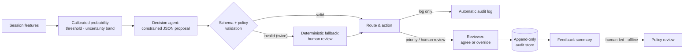

1. The MLP returns a calibrated probability, threshold, uncertainty flag, and supporting signals.
2. The decision provider returns fixed-schema JSON with a route, priority, action, reason code, and short explanation.
3. The validator checks the schema and the cross-field policy. Uncertain predictions must go to human review.
4. A deterministic fallback handles transport errors, invalid JSON, and policy violations.
5. The audit store keeps reviewer feedback for later analysis. No step retrains the model or edits the policy.

See [docs/decision-loop.md](docs/decision-loop.md) for the full contract.

## System architecture

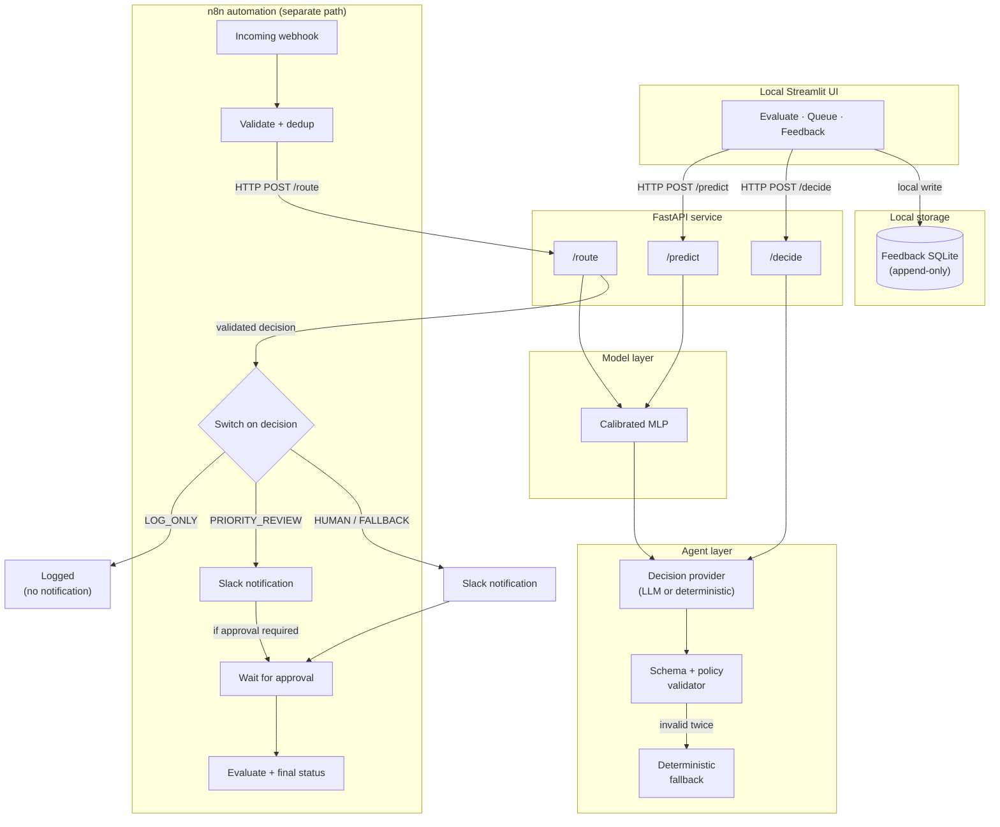

The UI and n8n call the same FastAPI service through separate paths. The UI never starts an n8n workflow, and UI feedback never resumes an n8n approval. Slack only delivers notifications. It does not predict, decide, or store workflow state.

`LOG_ONLY` stays silent. `PRIORITY_REVIEW` sends a notification and normally completes at once. `HUMAN_REVIEW` and `SYSTEM_FALLBACK` send a notification and wait for approval.

See [docs/architecture.md](docs/architecture.md) for component boundaries and environment settings.

## n8n automation

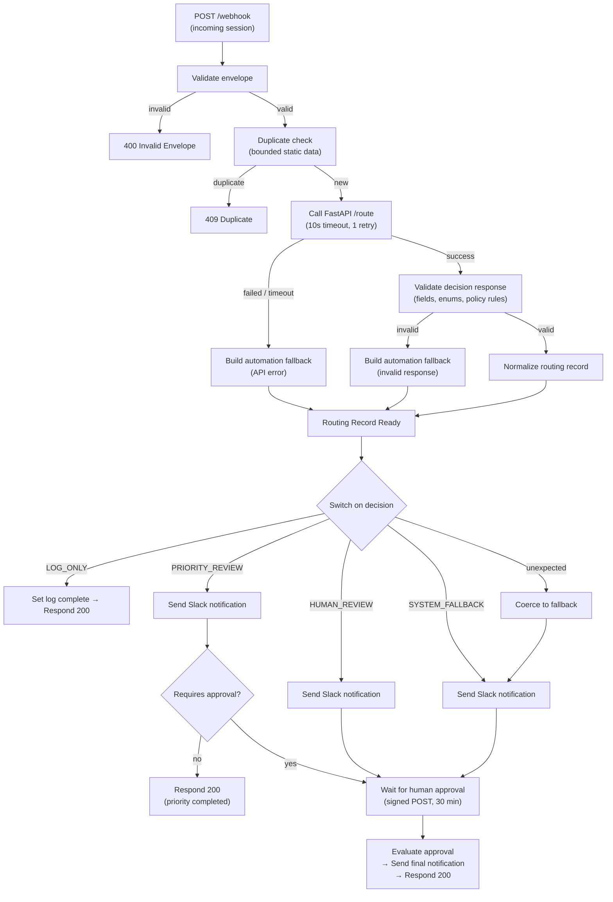

The export keeps credentials out of JSON and reads its webhook and API URLs from environment variables. It rejects duplicate request IDs before the API call. Invalid responses and API failures become `SYSTEM_FALLBACK`. Notification failure does not crash the full workflow.

See [docs/n8n-workflow.md](docs/n8n-workflow.md) for node-level documentation and [docs/automation-test-report.md](docs/automation-test-report.md) for branch coverage.

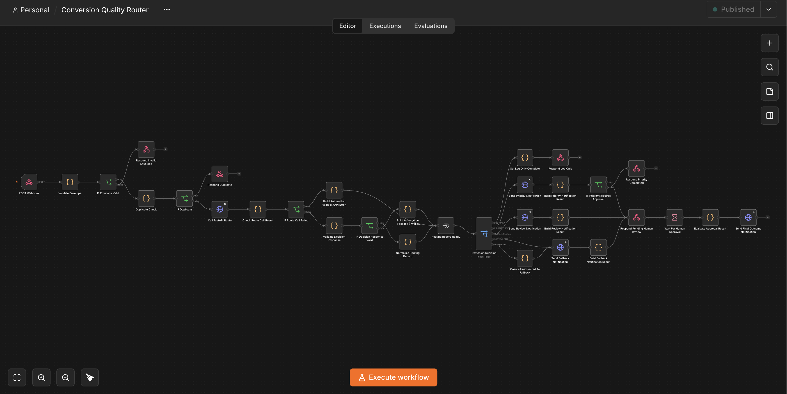

*The workflow validates the request, calls the routing API, switches on the decision, sends notifications, and handles approval.*

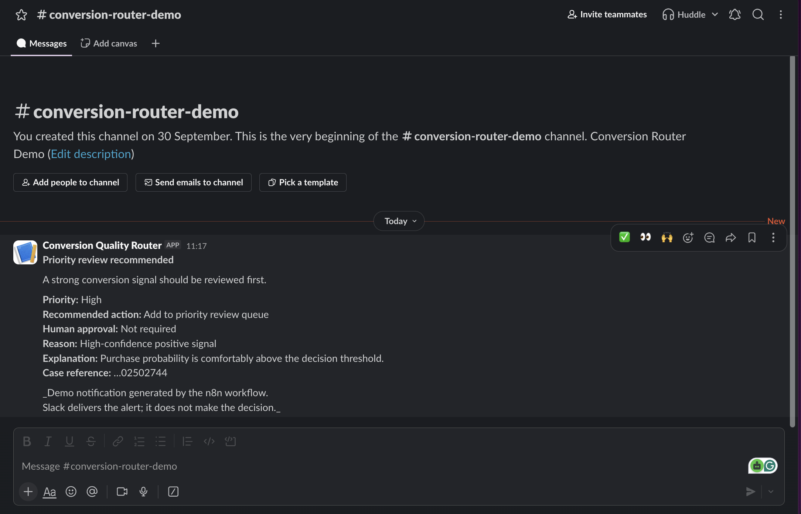

*A real priority-review notification from the local model and n8n workflow. Slack carries the alert but does not make the decision.*

## Model and evaluation

The project trains a PyTorch MLP with layers `128 → 64 → 32 → 1`, dropout 0.3, and early stopping on validation PR-AUC. It uses the [UCI Online Shoppers Purchasing Intention Dataset](https://archive.ics.uci.edu/dataset/468/online+shoppers+purchasing+intention+dataset), which contains 12,330 sessions and a 15.5% positive rate.

Isotonic calibration uses validation data. A 5:1 cost-ratio search on the same split selects the 0.12 decision threshold. The uncertainty band covers ±0.05 around that threshold.

| Metric | Baseline (LogReg) | MLP (calibrated) |
|---|---:|---:|
| PR-AUC | 0.302 | 0.316 |
| ROC-AUC | 0.7433 | 0.7543 |
| Brier score | n/a | 0.1177 |
| Precision / Recall | 0.2506 / 0.7832 | 0.2514 / 0.7797 |

The MLP improves PR-AUC by 0.014 over logistic regression. The gain is modest. PR-AUC remains the primary metric because conversions are relatively rare.

<details>
<summary>Calibration and discrimination</summary>

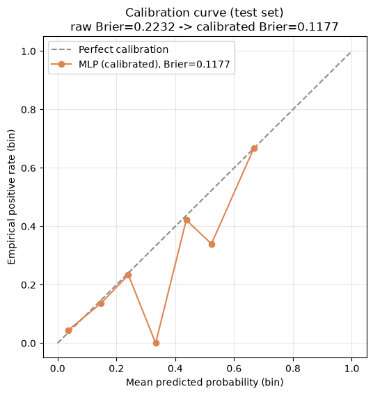

*Isotonic calibration reduces the test Brier score from 0.2232 to 0.1177.*

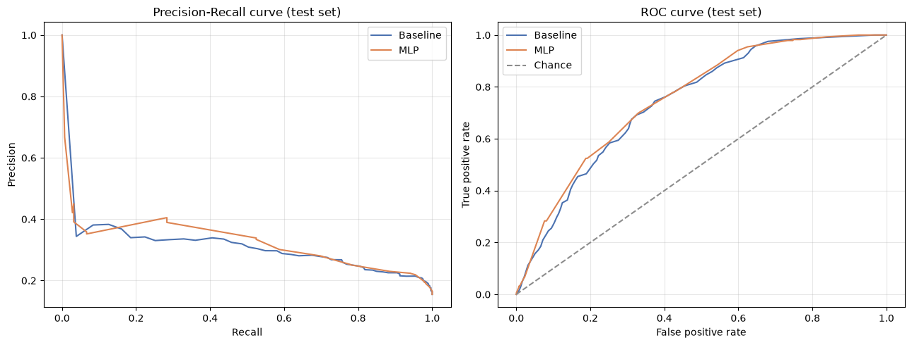

*The MLP performs slightly better than the baseline across most recall levels.*

</details>

<details>
<summary>Threshold and workload</summary>

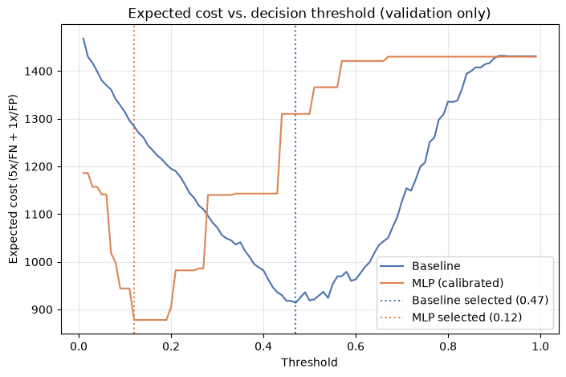

*The validation cost search selects threshold 0.12. Lower thresholds increase recall and workload.*

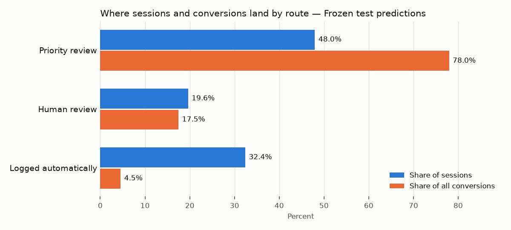

*The review routes capture 95.5% of conversions while covering 67.6% of sessions.*

</details>

A bounded [hyperparameter sensitivity study](docs/hyperparameter-sensitivity.md) compares five configurations across three seeds. No alternative meets the preregistered promotion rule, so v1 remains the reference model.

Read the [model card](docs/model-card.md), [evaluation card](docs/evaluation-card.md), and [test evaluation report](docs/test-evaluation-report.md) for more detail.

## Safety boundaries

- The router only assigns review priority. It does not deny service or take an irreversible action.
- Any model, agent, network, or validation failure goes to `SYSTEM_FALLBACK` and human review.
- The fixed schema prevents the agent from inventing routes or changing the model probability.
- The policy validator sends every uncertain prediction to `HUMAN_REVIEW`.
- The API allows one retry, for two attempts in total.
- Database triggers block updates and deletes from the feedback store.
- Feedback never retrains the model or changes policy automatically.

Read [docs/agent-policy.md](docs/agent-policy.md) and [docs/agent-card.md](docs/agent-card.md) for the complete guardrails.

## Limitations

- The dataset has no real timestamp, so the evaluation has no temporal holdout.
- The MLP improves PR-AUC by only 0.014 over logistic regression.
- Calibration and uncertainty use one validation split from one dataset.
- `TrafficType` is an anonymized code, so it cannot support platform-specific claims.
- n8n keeps duplicate IDs in process memory, not in a durable store.
- The prototype runs as one local instance without queue mode, horizontal scaling, or container deployment.
- The worked cases use scripted reviewer actions, not observed user behavior.
- A new target population would require fresh calibration and threshold evaluation.

## Project structure

```text
src/conversion_router/
    data/           Data loading, validation, preprocessing
    modeling/       Baseline and MLP training, calibration, inference
    agent/          Decision provider, schema validation, fallback
    api/            FastAPI endpoints
    feedback/       Feedback schema, append-only store, summary
    ui/             Streamlit UI
scripts/            Training, evaluation, smoke tests, QA
automation/         n8n export, scripts, fixtures
notebooks/          Executed end-to-end analysis
tests/              Unit and integration tests
docs/               Architecture, policies, reports, figures
prompts/            Versioned agent prompt
artifacts/metadata/ Thresholds, hashes, metrics
data/sample/        50-row sample fixture
```

## Reproducibility

- Split, baseline, and MLP training use seed `42`.
- `artifacts/metadata/*.json` records thresholds, package versions, and artifact hashes.
- The project accesses the test split once, after freezing model and threshold choices.
- [`scripts/verify_clean_room.sh`](scripts/verify_clean_room.sh) rebuilds and checks the pipeline from a clean checkout.

## Documentation

| Document | Covers |
|---|---|
| [Case study](docs/case-study.md) | Problem, solution, evidence, limitations |
| [Decision loop](docs/decision-loop.md) | Prediction and routing logic |
| [Decision cases](docs/decision-cases.md) | Two validation examples |
| [Operational impact](docs/operational-impact.md) | Workload and conversion coverage |
| [Architecture](docs/architecture.md) | Components, environment, artifacts |
| [Model card](docs/model-card.md) | Model, data, metrics, limitations |
| [Agent card](docs/agent-card.md) | Inputs, outputs, validation, failures |
| [Evaluation card](docs/evaluation-card.md) | Test design and acceptance checks |
| [Agent policy](docs/agent-policy.md) | Decision contract and fallback |
| [n8n workflow](docs/n8n-workflow.md) | Automation setup and node behavior |
| [Automation test report](docs/automation-test-report.md) | n8n branch evidence |
| [Leakage audit](docs/leakage-audit.md) | Feature review and duplicate handling |
| [Baseline report](docs/baseline-report.md) | Baseline metrics and threshold selection |
| [Test evaluation report](docs/test-evaluation-report.md) | Final metrics and error analysis |
| [Hyperparameter sensitivity](docs/hyperparameter-sensitivity.md) | Five configurations across three seeds |

## Licensing

The code uses the [MIT License](LICENSE).

The [UCI Online Shoppers Purchasing Intention Dataset](https://archive.ics.uci.edu/dataset/468/online+shoppers+purchasing+intention+dataset) uses the **CC BY 4.0** license. Its DOI is [10.24432/C5F88Q](https://doi.org/10.24432/C5F88Q). The committed [50-row sample](data/sample/online_shoppers_sample.csv) keeps the same license. This repository does not claim ownership of the dataset.

Third-party packages keep their own licenses. See [data/README.md](data/README.md) for dataset details and reproduction steps.
