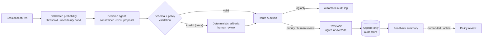
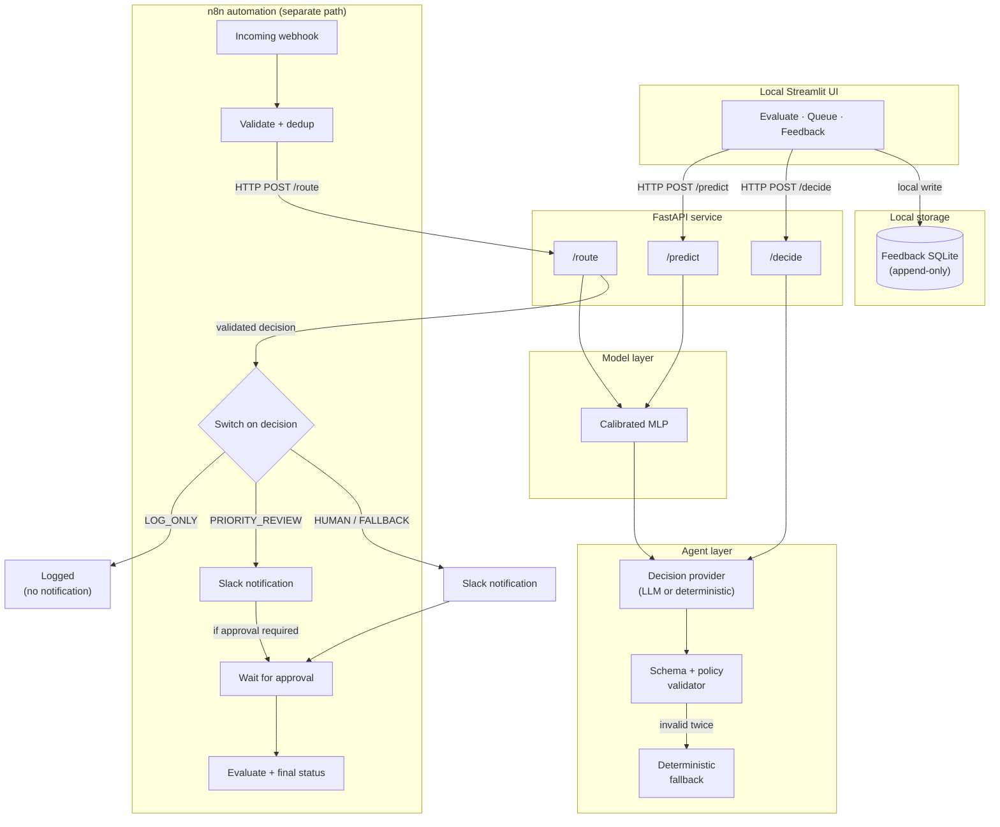
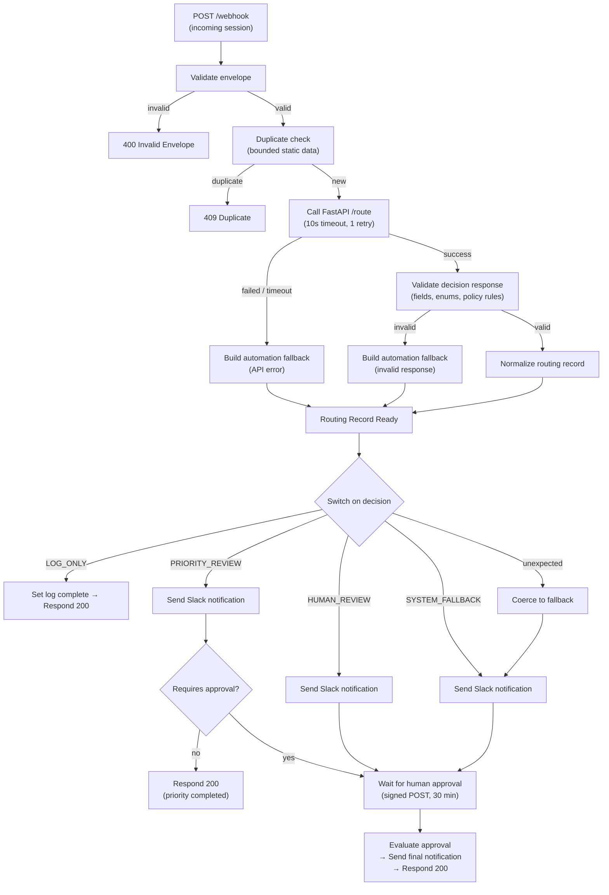

# Conversion Quality Router

**An uncertainty-aware decision-support prototype that triages e-commerce sessions into priority review, human review, or automatic audit logging — so a capacity-constrained analyst knows which sessions to look at first.**

Built on a public dataset. Not connected to a live event stream.

[](LICENSE)
[](https://www.python.org/downloads/release/python-3110/)

---


*A reviewer sees calibrated evidence — probability, threshold, uncertainty band — alongside the routing decision, priority, and supporting signals.*

## Why this project exists

A prediction score alone does not tell a team what to do. A session scored at 28% purchase probability could be a clear positive, an uncertain boundary case, or a confident negative — it depends on the threshold, the model's confidence near that threshold, and the team's capacity.

This prototype turns a calibrated probability into an **operational routing decision**:

- **Priority review** — the model is confident the session is likely to convert; an analyst should look at it first.
- **Human review** — the model is uncertain; a person must decide.
- **Log automatically** — the model is confidently negative; no reviewer time is needed.

A constrained decision agent proposes the route. Schema validation and cross-field policy rules enforce it. If anything fails — the model, the agent, or the network — the system falls back to human review, never to silence. Reviewer feedback is recorded in a local append-only store for later human-led policy review. Nothing retrains the model or changes the policy automatically.

## Local quickstart

```bash
# One-time setup
python3.11 -m venv venv
venv/bin/python -m pip install --upgrade pip
venv/bin/python -m pip install -e ".[dev,ui]"
venv/bin/python scripts/download_data.py
venv/bin/python scripts/make_split.py
venv/bin/python scripts/train_baseline.py
venv/bin/python scripts/select_baseline_threshold.py
venv/bin/python scripts/train_mlp.py
venv/bin/python scripts/calibrate_mlp.py
venv/bin/python scripts/finalize_mlp.py
venv/bin/python scripts/evaluate_test.py

# Start the UI (zero external calls)
scripts/start_ui.sh
```

Open **http://127.0.0.1:8501** and try:

1. Select the **strong purchase-signal preset** → see priority review routing.
2. Switch to the **uncertain preset** → see human review routing.
3. Try the **weak/auto-log preset** → see automatic logging.
4. On a routed result, **agree** or **override** the recommendation.
5. Switch to the **Review Queue** tab to see queued sessions.
6. Open the **Feedback & Audit** tab to inspect recorded decisions and summary statistics.

Stop with `scripts/stop_ui.sh`. For detailed setup and troubleshooting, see [docs/architecture.md](docs/architecture.md).

## Product walkthrough

The UI has three areas:

### Evaluate a Session

Enter session features and get a routing decision. Two input modes:

- **Basic** — preset scenarios with human-readable labels (visitor type, session context, engagement level). Under the hood, these map to the 16 deployment-safe features.
- **Advanced** — direct numeric and categorical inputs matching the model's feature contract, including technical category IDs (operating system, browser, region, traffic source).

Two evaluation modes:

- **Model only** — returns the calibrated purchase probability, decision threshold, uncertainty band, and supporting signals. No routing decision.
- **Full decision routing** — runs the model, then the constrained decision agent, returning the probability *and* the operational route (priority review, human review, or log automatically).

The result view shows:
- The **calibrated purchase probability** as a visual gauge against the **decision threshold** and **uncertainty band**.
- The routed decision, priority, and action.
- Supporting signals explaining the prediction context.

After evaluating a session with full decision routing, a **Reviewer feedback** panel appears below the result. The reviewer can agree with the recommendation or override it with a structured reason. Feedback is recorded in the local append-only SQLite store.

### Review Queue

Sessions evaluated in the current browser session appear in a review queue, sorted by priority. Each entry shows the probability, route, and status. This queue is a browser-session-only view — it is not persisted and does not record feedback.

### Feedback & Audit

Displays all feedback recorded in the local append-only SQLite store:
- A table of every recorded review decision.
- Summary statistics: agreement rate, override rate, override direction, and most frequent override reasons.
- This data is **evidence for a person** deciding whether to adjust the threshold, the uncertainty band, or the policy. The system does not act on it automatically.


*Local feedback summary: agreement and override rates, overrides by recommended route, and override reasons. These records are entered manually in the local prototype; they are not a user study.*

## Operational impact

Applied to the frozen test split (n = 1,845 sessions, 286 conversions, 15.5% base rate), the routing policy distributes reviewer attention as follows:

| Route | Sessions | Share | Conversions in route | Conversion coverage |
|---|---:|---:|---:|---:|
| Priority review | 885 | 48.0% | 223 (25.2% route rate) | 78.0% |
| Human review | 362 | 19.6% | 50 (13.8% route rate) | 17.5% |
| Log automatically | 598 | 32.4% | 13 (2.2% route rate) | 4.5% |

The review queue (priority + human review) captures **95.5%** of observed conversions while covering 67.6% of sessions. A random selection of the same size would capture 67.6%. The automatic log contains 13 conversions (4.5% of all conversions) — the cost of not reviewing confidently negative sessions.

All 362 uncertain sessions were routed to human review. Zero safety fallbacks occurred.

These numbers are observed in the frozen test split and represent an illustrative workload allocation, not a causal impact, revenue, or ROI estimate. Source: [docs/operational-impact.md](docs/operational-impact.md).

## Two end-to-end cases

Both cases use real validation-split rows through the full model and agent chain with the deterministic demo provider. Reviewer actions are scripted illustrations, not observed user-study outcomes. Full records: [docs/decision-cases.md](docs/decision-cases.md).

### Case 1: Strong signal → priority review → reviewer agrees

A returning visitor in November views 256 product pages over 3.7 hours with near-zero bounce and exit rates.

- **Model evidence** — calibrated purchase probability **66.7%**, well above the 12% threshold (54.7 pp margin). Clear signal, not uncertain.
- **Route** — `PRIORITY_REVIEW`, high priority. Reason: `HIGH_CONFIDENCE_POSITIVE`.
- **Action** — added to the priority review queue; human approval not required.
- **Reviewer** — agrees with the recommendation.
- **Audit** — the agree decision is recorded with a SHA-256 input fingerprint, model/agent versions, and a timestamp. Retrievable from the append-only store.

### Case 2: Uncertain signal → human review → reviewer overrides

A returning visitor in March views 10 product pages over 4.7 minutes with a zero bounce rate but a 4.3% exit rate.

- **Model evidence** — calibrated purchase probability **11.1%**, just below the 12% threshold (0.9 pp margin). **Uncertain**: inside the ±5 pp uncertainty band.
- **Route** — `HUMAN_REVIEW`, medium priority. Reason: `MODEL_UNCERTAIN`. Human approval required.
- **Reviewer** — overrides to "log automatically" with reason: *signal weaker than scored* ("Only 10 product pages and a high exit rate").
- **Audit** — the override is recorded with the structured reason, the reviewer's note, and the final human-selected decision (`LOG_ONLY`).

## The agentic decision loop

This prototype is more than a prediction endpoint. "Agentic" here means **constrained orchestration and decision routing**, not an autonomous unconstrained agent.



Each step in the loop:

1. **Model produces calibrated evidence** — the MLP outputs a purchase probability, calibrated on validation data. The API returns the probability, the decision threshold, the uncertainty flag, and supporting signals.
2. **Constrained decision provider applies written policy** — the agent receives only the validated prediction payload (never raw user text) and must respond with a fixed JSON schema: one of three decisions, a priority, the matching action, reason codes from a closed list, and a short explanation. It cannot call tools, change the probability, or invent a route.
3. **Schema validation limits outputs** — every proposal is checked against the JSON schema and cross-field policy rules. Each decision must pair with exactly one action. An uncertain prediction must become `HUMAN_REVIEW` regardless of what the agent proposed.
4. **Uncertainty sends ambiguous cases to humans** — sessions within ±5 pp of the threshold are flagged uncertain. The policy validator enforces that uncertain sessions are always routed to human review.
5. **Deterministic fallback on any failure** — if both attempts fail (transport error, invalid JSON, schema violation), a plain Python function produces a `SYSTEM_FALLBACK` decision that routes to human review. The system never guesses a route it could not validate.
6. **Automation can notify, wait, and resume** — the n8n workflow (a separate operational path) receives the route and sends a Slack notification for non-`LOG_ONLY` routes. `HUMAN_REVIEW` and `SYSTEM_FALLBACK` routes pause on a signed wait node until a reviewer approves or the 30-minute window expires. `PRIORITY_REVIEW` completes immediately unless `requires_human_approval` is true.
7. **Reviewer feedback is retained for human-led analysis** — each agree or override is stored in a local append-only SQLite file with the model evidence, agent decision, human response, structured reason, and version identifiers.
8. **No automatic retraining or silent policy modification** — the feedback summary is evidence for a person. Nothing in the loop changes the model, the threshold, or the policy automatically.

Details: [docs/decision-loop.md](docs/decision-loop.md).

## System architecture



**Key boundaries:**
- The Streamlit UI and n8n are **independent front ends** to the same FastAPI service. The UI does not invoke n8n. UI feedback does not resume an n8n execution.
- Local UI feedback is stored in **local SQLite**. n8n owns **operational waiting and resume** via its signed approval webhook.
- Slack is **notification transport only** — it does not predict, decide, or own state.
- `LOG_ONLY` does not trigger a Slack notification.
- `PRIORITY_REVIEW` sends a notification and completes immediately unless the decision's `requires_human_approval` flag is true.
- `HUMAN_REVIEW` and `SYSTEM_FALLBACK` always send a notification and wait for human approval.
- The local deterministic decision provider follows the same written policy and validation boundary without an external language-model call.

Architecture details: [docs/architecture.md](docs/architecture.md).

## n8n automation flow



**Key properties:**
- The workflow is credential-free in its exported JSON — webhook URL and API base URL are `{{$env.*}}` expressions.
- Duplicate protection uses bounded workflow static data (max 500 entries, 24-hour TTL).
- Any API failure or invalid decision response produces an automation-origin `SYSTEM_FALLBACK`, not a crash.
- `LOG_ONLY` performs no external action. The other three routes send a Slack notification.
- Notifications use human-readable Slack mrkdwn with labeled fields (priority, action, reason, short case reference), not raw enum values or debug formatting. Each notification includes a context line: "Slack delivers the alert; it does not make the decision."
- The wait node uses a signed, `POST`-only resume URL with a 30-minute bound.

Full node-by-node documentation: [docs/n8n-workflow.md](docs/n8n-workflow.md). Test evidence: [docs/automation-test-report.md](docs/automation-test-report.md).


*The n8n workflow canvas: incoming webhook through validation, deduplication, API call, decision switch, notification, and approval paths. The Mermaid diagram above is the stable architectural reference; this screenshot shows the actual editor layout.*


*End-to-end notification example: a strong purchase signal is routed through the local model and n8n workflow to Slack. Slack delivers the operational alert; the validated decision is produced upstream by the model and constrained routing policy.*

## Model and evaluation

A PyTorch MLP (`128 → 64 → 32 → 1`, dropout 0.3, early stopping on validation PR-AUC) trained on the [UCI Online Shoppers Purchasing Intention Dataset](https://archive.ics.uci.edu/dataset/468/online+shoppers+purchasing+intention+dataset) (12,330 sessions, 15.5% positive rate). Isotonic calibration on validation data. Decision threshold (0.12) selected by a 5:1 cost-ratio grid search on validation only. Uncertainty band: ±0.05 around the threshold.

**Test set (n = 1,845, touched once):**

| Metric | Baseline (LogReg) | MLP (calibrated) |
|---|---|---|
| PR-AUC | 0.302 | 0.316 |
| ROC-AUC | 0.7433 | 0.7543 |
| Brier score | — | 0.1177 |
| Precision / Recall | 0.2506 / 0.7832 | 0.2514 / 0.7797 |

The MLP's improvement is small but consistent (+0.014 PR-AUC) — reported honestly, not oversold. PR-AUC is the primary metric because the target is imbalanced.

<details>
<summary>Calibration and discrimination</summary>


*Isotonic calibration reduces Brier score from 0.2232 (raw sigmoid) to 0.1177 on the test set. The calibration curve shows predicted probabilities tracking observed conversion rates across bins.*


*PR-AUC is the primary metric for this imbalanced target. The MLP curve sits slightly above the baseline across most recall levels.*

</details>

<details>
<summary>Threshold and workload behavior</summary>


*The 5:1 cost-ratio grid search on validation data selects threshold 0.12. Lower thresholds send more sessions to review (higher recall, lower precision); higher thresholds miss more conversions.*


*How the frozen routing policy distributes sessions and conversions across routes on the test split. The review queue captures 95.5% of conversions while covering 67.6% of sessions.*

</details>

**Hyperparameter sensitivity.** A [bounded validation-only study](docs/hyperparameter-sensitivity.md) compared 5 configurations across 3 seeds (15 runs). No configuration met the preregistered threshold for a notable candidate. The total PR-AUC range was 0.006 (0.3552–0.3611), confirming that the v1 configuration is not uniquely optimal but no alternative demonstrated a robust improvement. V1 remains authoritative.

Deeper documentation: [docs/model-card.md](docs/model-card.md) · [docs/evaluation-card.md](docs/evaluation-card.md) · [docs/test-evaluation-report.md](docs/test-evaluation-report.md).

## Safety boundaries

- **No irreversible action.** The system routes review priority; it does not deny, restrict, or take any irreversible action against a session or a person.
- **Fail to human.** Every failure — model, agent, network, validation — produces a `SYSTEM_FALLBACK` that routes to human review. The system never silently drops a session.
- **Schema-enforced outputs.** The agent cannot invent a route, change the probability, or produce free-form output. `SYSTEM_FALLBACK` is not in the schema sent to the provider — the model cannot select it.
- **Uncertainty forces human review.** The cross-field validator overrides any agent proposal for uncertain predictions: they must become `HUMAN_REVIEW`.
- **Bounded retry.** At most one retry (two attempts total). No error-correction feedback loop.
- **Append-only audit.** Feedback rows cannot be updated or deleted. One review per request.
- **No automatic retraining.** Feedback is evidence for humans. The loop never changes the model, threshold, or policy.

Agent guardrails: [docs/agent-policy.md](docs/agent-policy.md) · [docs/agent-card.md](docs/agent-card.md).

## Limitations and non-goals

- The dataset has no real timestamp field — there is no temporal holdout.
- The MLP's improvement over logistic regression is small (+0.014 PR-AUC).
- Calibration and uncertainty band are fit on one validation split of one dataset, not validated against a second source.
- `TrafficType` is an anonymized integer code — no platform-dependence claim is made or supportable.
- n8n's duplicate store uses in-process workflow static data, not a durable external store.
- This is a single-instance, local proof of concept — no queue mode, no horizontal scaling, no container deployment.
- Feedback volume is whatever reviewers enter locally; worked cases use scripted actions.
- The system should not be deployed against a materially different population without re-evaluating calibration and the threshold on that population's held-out data.

## Project structure

```
src/conversion_router/
    data/           Data loading, validation, preprocessing
    modeling/       Baseline and MLP training, calibration, inference
    agent/          Decision provider, schema validation, fallback
    api/            FastAPI endpoints (/health, /ready, /predict, /decide, /route)
    feedback/       Reviewer feedback schemas, append-only store, summary
    ui/             Streamlit UI (evaluate, queue, feedback)
scripts/            Reproducible entrypoints (download, train, evaluate, smoke-test, QA)
automation/         n8n workflow export + start/stop scripts + fixtures
notebooks/          One narrated, executed evaluation notebook
tests/              Unit and integration tests
docs/               Architecture, policy, workflow, cards, reports, figures
prompts/            Versioned agent system prompt
artifacts/metadata/ Git-tracked JSON evidence (thresholds, hashes, metrics)
data/sample/        Committed 50-row sample fixture (CC BY 4.0)
```

## Reproducibility

- Seed `42` throughout (split, baseline, MLP training).
- `artifacts/metadata/*.json` records exact thresholds, uncertainty band, artifact SHA-256 hashes, and package versions.
- The test set is touched exactly once, after all model/threshold/calibration decisions are frozen.
- The full pipeline — fresh venv, install, download, retrain, evaluate, API smoke, n8n import — is independently verified from a clean checkout: [`scripts/verify_clean_room.sh`](scripts/verify_clean_room.sh).

## Documentation

| Document | Purpose |
|---|---|
| [Case study](docs/case-study.md) | Standalone narrative: problem, solution, evidence, limitations |
| [Decision loop](docs/decision-loop.md) | How prediction becomes a routing decision |
| [Decision cases](docs/decision-cases.md) | Two worked end-to-end validation cases |
| [Operational impact](docs/operational-impact.md) | Route distribution and conversion coverage on the frozen test split |
| [Architecture](docs/architecture.md) | Component boundaries, environment variables, artifact paths |
| [Model card](docs/model-card.md) | Model purpose, data, metrics, limitations |
| [Agent card](docs/agent-card.md) | Agent inputs/outputs, schema, validation, failure modes |
| [Evaluation card](docs/evaluation-card.md) | Evaluation design, test discipline, acceptance matrix |
| [Agent policy](docs/agent-policy.md) | Decision agent contract, validation rules, fallback |
| [n8n workflow](docs/n8n-workflow.md) | Node-by-node automation flow, setup, contracts |
| [Automation test report](docs/automation-test-report.md) | Observed evidence for every n8n branch and error scenario |
| [Leakage audit](docs/leakage-audit.md) | Per-feature leakage review, PageValues exclusion, duplicate handling |
| [Baseline report](docs/baseline-report.md) | Logistic regression baseline metrics and threshold selection |
| [Test evaluation report](docs/test-evaluation-report.md) | Final test-set metrics, confusion matrices, error analysis |
| [Hyperparameter sensitivity](docs/hyperparameter-sensitivity.md) | Bounded validation-only sensitivity study (5 configs × 3 seeds) |

## Licensing

**Repository code** is released under the [MIT License](LICENSE).

**Dataset:** The [UCI Online Shoppers Purchasing Intention Dataset](https://archive.ics.uci.edu/dataset/468/online+shoppers+purchasing+intention+dataset) (DOI: [10.24432/C5F88Q](https://doi.org/10.24432/C5F88Q)) is licensed separately under **CC BY 4.0**. The committed 50-row sample fixture ([data/sample/online_shoppers_sample.csv](data/sample/online_shoppers_sample.csv)) is redistributed under the same CC BY 4.0 license. This repository does not claim ownership of or relicense the dataset.

**Third-party packages** (listed in `pyproject.toml`) are distributed under their own licenses. This project does not bundle or relicense them.

Full dataset documentation and reproduction steps: [data/README.md](data/README.md).
