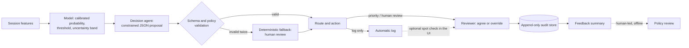

# The Decision Loop

This prototype does not stop at "will this session convert?". It turns a model
score into a bounded, auditable routing decision, puts uncertain cases in front
of a person, and records what that person decided so the policy can be reviewed
later. This page explains each step, what is automated, and where people stay in
control. Worked examples are in [`decision-cases.md`](decision-cases.md); the
operational effect on frozen test predictions is in
[`operational-impact.md`](operational-impact.md).

It runs on a public dataset and is not connected to a live event stream.

## 1. Session in

A session arrives as the 16 deployment-safe features of the request contract
(`SessionFeaturesRequest`). Unknown fields, out-of-range numbers, and categories
outside the whitelist are rejected before any model code runs.

## 2. Model evidence

The PyTorch MLP produces a probability, which isotonic calibration turns into the
**calibrated purchase probability**. It is compared with a **decision threshold
of 0.12**, chosen on validation data with a 5:1 cost for a missed conversion versus
an unnecessary review. Sessions within **±0.05** of the threshold are flagged
**uncertain**. The API also returns rule-based **signals** (for example "low bounce
rate") as readable context. None of these values can be changed by later steps.

## 3. Decision agent (bounded)

A language model receives only the validated prediction (never raw user text) and
must answer with a fixed JSON shape: one of three decisions (`LOG_ONLY`,
`PRIORITY_REVIEW`, `HUMAN_REVIEW`), a priority, the matching action, an approval
flag, reason codes from a closed list, and a short explanation. It cannot call
tools, change the probability, move the threshold, or invent a route.

## 4. Validation, retry, fallback

The proposal is checked twice: against the JSON schema, then against policy rules
that a schema cannot express. Each decision must pair with exactly one action, and
an uncertain prediction must become `HUMAN_REVIEW` with approval required and the
`MODEL_UNCERTAIN` reason. A failing answer gets one identical retry. If that also
fails, or the provider is unreachable, a plain Python function returns
`SYSTEM_FALLBACK`: high priority, review queue, human approval required. The
system never guesses a route it could not validate.

## 5. Route and operational action

| Route | Action | Human approval |
|---|---|---|
| Log automatically (`LOG_ONLY`) | Add to audit log | No |
| Priority review (`PRIORITY_REVIEW`) | Add to priority review queue | Only if flagged |
| Human review (`HUMAN_REVIEW`) | Add to review queue | Yes |
| Safety fallback (`SYSTEM_FALLBACK`) | Add to review queue | Yes |

Two front ends use the same API. The n8n workflow (`POST /route`) notifies the team
on every review route and waits for an approval webhook whenever approval is
required (see [`n8n-workflow.md`](n8n-workflow.md)). The local Streamlit UI
(`POST /predict`, then `POST /decide` for that same prediction) shows the evidence
and route to an analyst and groups routed sessions into a review queue.

## 6. Human feedback and audit

On a routed case (including an automatically logged one, as a spot check) the
reviewer either **agrees** or **overrides**. An override needs a different
decision and a structured reason (for example "review resolved the
model's uncertainty"); the reason "other" needs a note. A safety fallback has no
recommendation to agree with, so the reviewer must pick a decision.

Each review becomes one row in a local SQLite file
(`logs/feedback/feedback.sqlite3`, never committed). The row links the model
evidence, the agent's decision, the human response, the final decision, and the
model, agent, and schema versions. It stores a SHA-256 fingerprint of the input
rather than the raw features. The database rejects updates and deletes, and each
request can be reviewed once.

## 7. Policy review stays human

The UI summarises the feedback: agreement and override rates, overrides by route,
the most frequent reasons, and override direction. That summary is **evidence for
a person** deciding whether the threshold, the uncertainty band, or the policy
prompt should change. Nothing in the loop retrains the model or edits a threshold
or the policy automatically. Any change would be a new, versioned decision,
validated on validation data only, with the test split kept untouched.

## What is automated and what is not

| Automated | Human |
|---|---|
| Input validation, scoring, calibration, uncertainty flag | Reviewing priority and uncertain sessions |
| Bounded route proposal, validation, retry, fallback | Agreeing with or overriding a route |
| Notifications (n8n) and the local audit record | Deciding whether the policy should change |

## Limits

- Feedback volume in this prototype is whatever reviewers enter locally; no
  real-world reviewer data exists, and the worked cases use scripted reviewer actions.
- Only one reviewer per request is recorded, and there is no authentication;
  the store is a single-user local file.
- The deterministic demo provider used for offline evidence reproduces the written
  policy. A live language model may word explanations differently and could choose
  a different route for a clear-cut session; the validator still forces every
  uncertain session to human review and enforces the route/action pairing.
