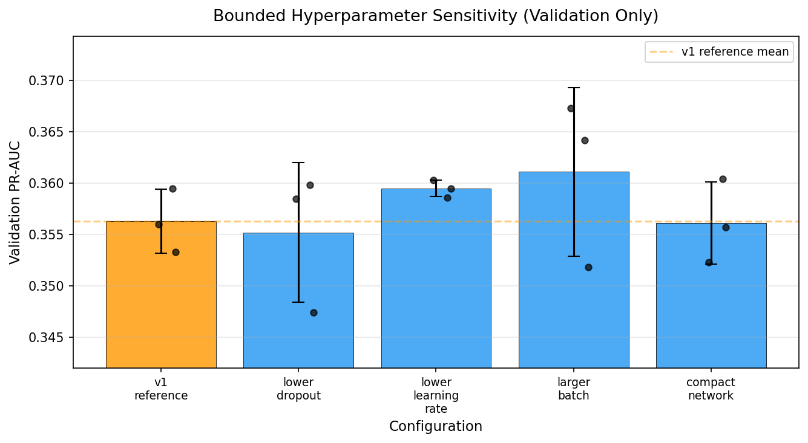

# Hyperparameter Sensitivity Study

## Why this study was conducted

The project's MLP used a reasonable fixed configuration (128→64→32, dropout 0.3, lr 0.001, batch 64) but did not show how sensitive the validation performance is to small changes in these training choices. This bounded, preregistered study addresses that methodological gap without claiming to be exhaustive optimization or automated model selection.

## Protocol

- **Data:** frozen group-aware train split (8,635 rows) for fitting; frozen validation split (1,850 rows) for all comparison. The test split was never accessed.
- **Preprocessor:** the existing fitted train-only preprocessor, reused unchanged.
- **Calibration:** no candidate calibrator was fitted. The study compares raw (uncalibrated) validation metrics only. Calibration-sensitive promotion would require a separate controlled protocol.
- **Checkpoints:** no candidate model checkpoints were saved. Models existed in memory only and were discarded after metric calculation.
- **Grid:** 5 configurations × 3 seeds = 15 runs, preregistered before execution and not expanded after seeing results.

## Preregistered configurations

| Name | Hidden sizes | Dropout | Learning rate | Batch size | Max epochs | Patience |
|---|---|---|---|---|---|---|
| `v1_reference` | 128, 64, 32 | 0.30 | 0.001 | 64 | 100 | 10 |
| `lower_dropout` | 128, 64, 32 | 0.20 | 0.001 | 64 | 100 | 10 |
| `lower_learning_rate` | 128, 64, 32 | 0.30 | 0.0003 | 64 | 100 | 10 |
| `larger_batch` | 128, 64, 32 | 0.30 | 0.001 | 128 | 100 | 10 |
| `compact_network` | 64, 32 | 0.30 | 0.001 | 64 | 100 | 10 |

**Seeds:** 17, 42, 73

## Reference reproducibility

Before the full study, `v1_reference` was rerun with seed 42. The observed validation PR-AUC (0.3560) matched the frozen v1 record (0.356), confirming reproducibility.

## Aggregate results

| Configuration | Mean PR-AUC | Std PR-AUC | Median PR-AUC | Mean ROC-AUC | Mean Brier | Mean log loss |
|---|---:|---:|---:|---:|---:|---:|
| `v1_reference` | 0.3563 | 0.0031 | 0.3560 | 0.7702 | 0.2026 | 0.5729 |
| `lower_dropout` | 0.3552 | 0.0068 | 0.3585 | 0.7705 | 0.2071 | 0.5825 |
| `lower_learning_rate` | 0.3595 | 0.0008 | 0.3595 | 0.7720 | 0.1890 | 0.5416 |
| `larger_batch` | 0.3611 | 0.0082 | 0.3642 | 0.7741 | 0.1978 | 0.5628 |
| `compact_network` | 0.3561 | 0.0040 | 0.3557 | 0.7708 | 0.1963 | 0.5592 |

## Per-seed results

| Configuration | Seed 17 | Seed 42 | Seed 73 |
|---|---:|---:|---:|
| `v1_reference` | 0.3595 | 0.3560 | 0.3533 |
| `lower_dropout` | 0.3598 | 0.3585 | 0.3474 |
| `lower_learning_rate` | 0.3586 | 0.3603 | 0.3595 |
| `larger_batch` | 0.3642 | 0.3673 | 0.3518 |
| `compact_network` | 0.3604 | 0.3523 | 0.3557 |

## Paired comparison with v1 reference

| Configuration | PR-AUC Δ | Seed wins | Std increase | Brier Δ | Meets all criteria |
|---|---:|---:|---:|---:|---|
| `lower_dropout` | −0.0010 | 2/3 | +0.0037 | +0.0045 | No |
| `lower_learning_rate` | +0.0032 | 2/3 | −0.0022 | −0.0136 | No |
| `larger_batch` | +0.0049 | 2/3 | +0.0051 | −0.0048 | No |
| `compact_network` | −0.0001 | 2/3 | +0.0010 | −0.0062 | No |

## Notable-candidate rule and outcome

A configuration qualifies as a validation candidate only if **all** conditions hold:

1. Mean validation PR-AUC ≥ 0.005 above the rerun reference mean
2. Beats the reference in ≥ 2 of the 3 paired seeds
3. PR-AUC standard deviation no more than 0.005 higher than the reference
4. Mean raw Brier score no worse than the reference by more than 0.002

**Outcome:** No configuration met all four criteria simultaneously.

- `larger_batch` had the highest mean PR-AUC (+0.0049) but its improvement fell just short of the 0.005 threshold and its standard deviation increased by 0.0051, exceeding the 0.005 limit.
- `lower_learning_rate` showed the lowest variance (std 0.0008) and the best raw Brier score, but its PR-AUC improvement (+0.0032) did not reach the threshold.

**"No robust validation-only candidate met the preregistered threshold."**

## Interpretation

The v1 configuration is not uniquely optimal, but no alternative in this bounded grid demonstrated a robust, preregistered-significant improvement on validation data. The performance differences across configurations are small (total PR-AUC range: 0.3552–0.3611, span of 0.006) and within the range of seed-to-seed variation.

This is consistent with the view that, for this dataset and model family, the specific hyperparameter choices matter less than the calibration layer and decision policy that sit on top of the model.

## Governance

**V1 remains the authoritative production/demo model (v1.0.0).** No model was promoted. No candidate checkpoint was saved. The test set was not accessed during this study.

Even if a candidate had met the preregistered threshold, it would only have been documented as `candidate_v2` for future investigation. Promotion would require a separate controlled protocol including: independent calibration comparison, fresh holdout evaluation, and a governance review.

## Limitations

- **Small bounded grid.** Five configurations varying one parameter each, not an exhaustive search.
- **Validation reuse.** The same validation split used for early stopping is also used for candidate comparison.
- **No candidate calibration comparison.** Raw (uncalibrated) metrics only. Calibration-sensitive differences may exist but were not measured.
- **No fresh independent holdout.** A truly independent comparison would require a held-aside validation set not used for early stopping.
- **Not an exhaustive HPO exercise.** The grid was chosen to probe sensitivity, not to find the global optimum.
- **No production or model promotion conclusion.** This is a validation-only sensitivity study. A validation winner is not a deployed winner.

## Reproducibility

The complete study specification and results are in [`hyperparameter_sensitivity_results.json`](hyperparameter_sensitivity_results.json). The study script is [`scripts/hyperparameter_sensitivity.py`](../scripts/hyperparameter_sensitivity.py).
